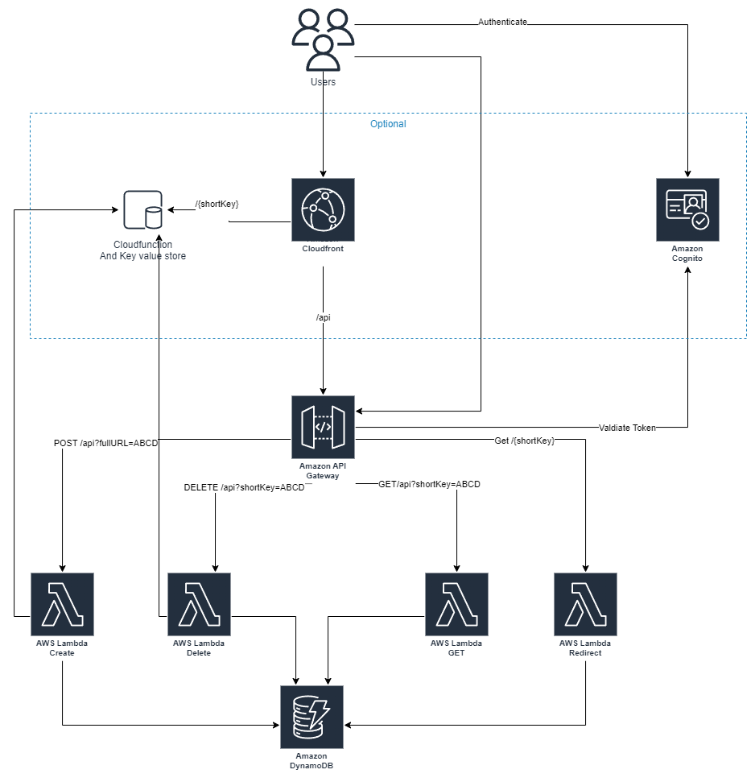

# Serverless URL Shortener
This is a serveless URL shortener app. It uses AWS as cloud and Api gateway, Lambda, DynamoDB and cloudFront as services. 
The app outputs an enpoint that are used in two cases:

1. Final user will enter endpoint/{shortKey} in a web browser and will be redirect to the fullURL
1. The administration API is available at endpoint/api and have the following methods:
    - ```GET``` Returns the fullURL and requires the shortKey parameter on query. Ex.: endpoint/api?shortKey=ABCDE
    - ```POST``` Create the shortKey and requires the fullURL encoded parameter on query. Ex.: endpoint/api?fullURL=https%253A%252F%252Fwww.mercadolivre.com.br%252F
    - ```DELETE``` Deletes an Item and requires the shortKey parameter on query. Ex.: endpoint/api?shortKey=ABCDE

## Architecture 


### Services Used
* <a href="https://aws.amazon.com/api-gateway/" target="_blank">Amazon API Gateway</a>
* <a href="https://aws.amazon.com/dynamodb/" target="_bank">Amazon DynamoDB</a>
* <a href="https://aws.amazon.com/cloudfront/" target="_blank">Amazon CloudFront</a>
* <a href="https://aws.amazon.com/lambda/" target="_blank">AWS Lambda</a> 


### Requirements for deployment
* An AWS Account with permission to run the components in us-east-1 or sa-east-1
* Know how to deploy a CloudFormation <a href="https://aws.amazon.com/cloudformation/" target="_blank">AWS CloudFormation</a> 

#### CloudFront option
On the CloudFormation deployment the parameter ```useCloudfront``` will control if the CloudFront distribution, routes, dunction and keyValueStore will be deployed. IF set to no the endpoint used will be the API Gateway endpoint 

## Cleanup
1. Open the <a href="https://us-west-2.console.aws.amazon.com/cloudformation/home" target="_blank">CloudFormation console</a>
1. Locate the a stack you've deployed
1. Select the radio option next to it
1. Select **Delete**
1. Select **Delete stack** to confirm

*Note: Some logs may be reitained on cloudWatch